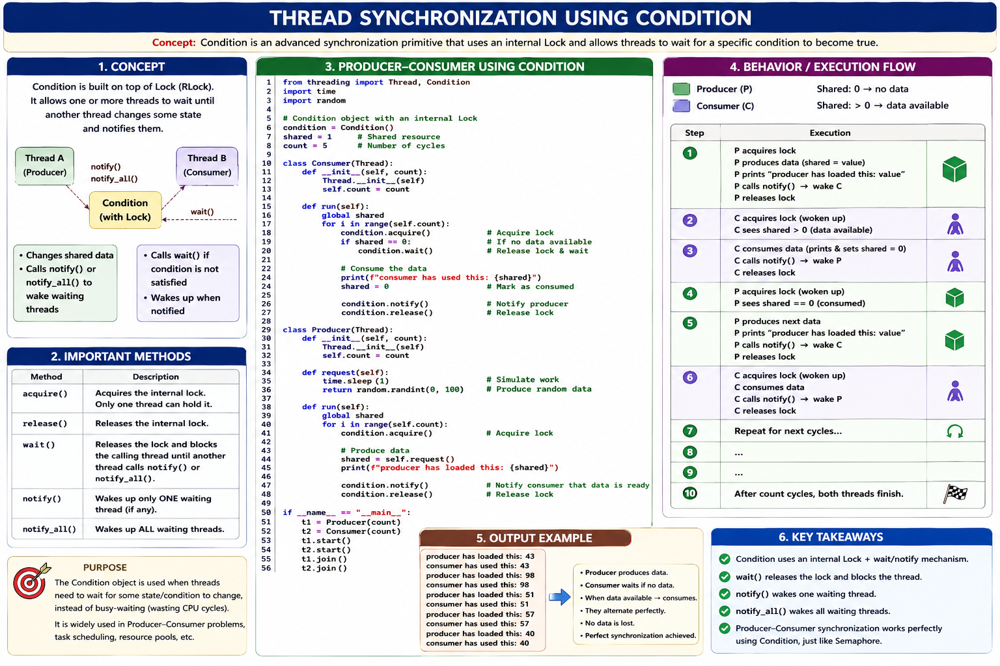

# Parallel and High Performance programming

This repository contains a collection of Python threading examples that demonstrate common parallel programming concepts.
The examples focus on thread creation, synchronization, producer-consumer coordination, and event-driven communication.

## What is included

- `src/multithreading/` with over 20 example scripts
- multiple synchronization patterns: `Lock`, `RLock`, `Semaphore`, `Condition`, `Event`, and `Queue`
- helper and runner scripts for simple execution
- diagram assets in `src/multithreading/thread-resources/`
 - `src/multiprocessing/` with basic process examples and diagrams

## Example categories

- Basic thread creation and lifecycle control: `thread_01_worker.py`, `thread_02_run_example.py`, `thread_03_join_sets.py`
- Thread pooling: `thread_04_threadpool_executor_example.py`
- Race conditions and ordering issues: `thread_05_sequence_ab.py`, `thread_06_race_condition_simple.py`
- Lock-based synchronization: `thread_07_lock_sync.py`, `thread_08_with_lock_context_manager.py`, `thread_09_unusual_lock_behaviour.py`
- Reentrant lock example: `thread_10_rlock.py`
- Semaphore-based coordination: `thread_11_semaphore.py`, `thread_12_semaphore_with_context.py`, `thread_13_semaphore_with_multiple_producer.py`, `thread_14_semaphore_order_issue.py`, `thread_15_semaphore_order.py`
- Condition variable coordination: `thread_16_condition.py`
- Event synchronization: `thread_17_event_based.py`, `thread_18_event_with_multiple_prd_consumer.py`
- Queue-based producer-consumer: `thread_19_queue.py`, `thread_20_queue_v.py`

## How to run examples

From the repository root, activate the Python environment and run any example directly:

```bash
. .venv/bin/activate
python src/multithreading/thread_01_worker.py
python src/multithreading/thread_16_condition.py
python src/multithreading/thread_20_queue_v.py
```

## Visual diagram assets

The repository contains these images in `src/multithreading/thread-resources/` and `src/multiprocessing/docs/`:

- `condition.png`
- `condition_wait_notify.svg`
- `semaphore.png`
- `with-join.png`
- `without_join.png`

These visuals illustrate thread coordination, lock usage, and producer-consumer patterns.

### Condition image



This image illustrates how condition variables coordinate producer and consumer threads.

### Multiprocessing diagram


This diagram (in `src/multiprocessing/docs/process.png`) illustrates the basic process lifecycle used by the examples in `src/multiprocessing/`.

## Additional documentation

See `src/multithreading/README.md` for a detailed rundown of the threading examples and how they are organized.
