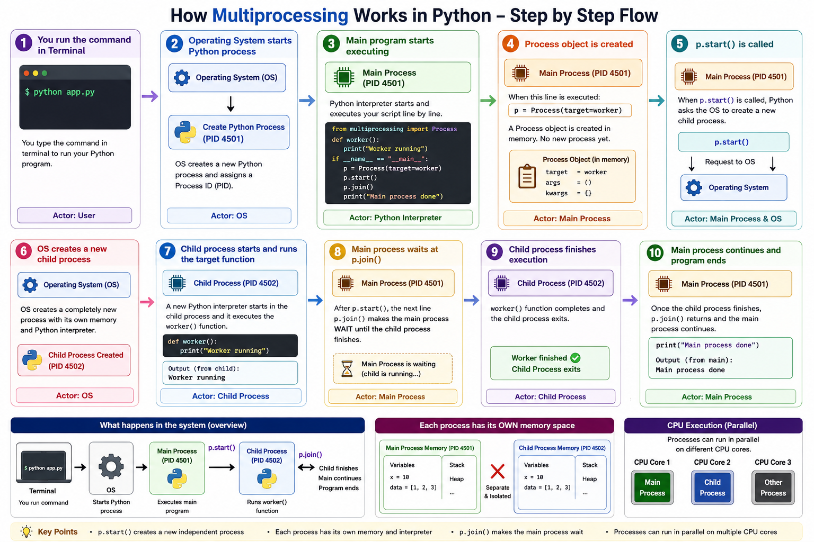

# Multiprocessing Examples

Working with Multiprocessing and mpi4py Library

This package contains Python examples that demonstrate the `multiprocessing` module.

The examples focus on:

- creating separate processes with `Process`
- communicating between processes using `Queue`
- coordinating work across worker processes

### Visuals

