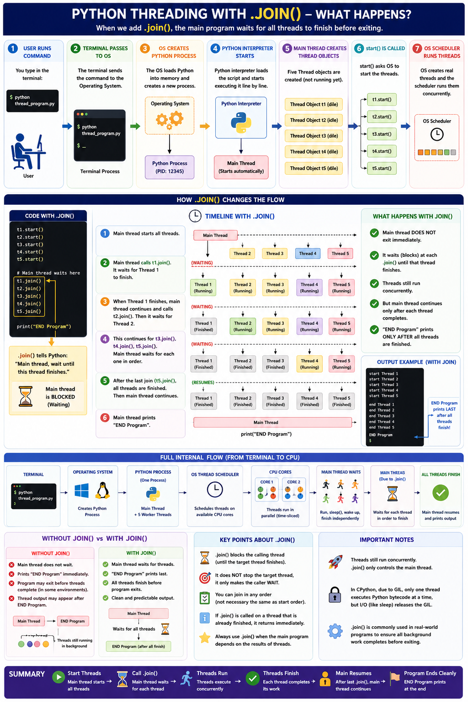
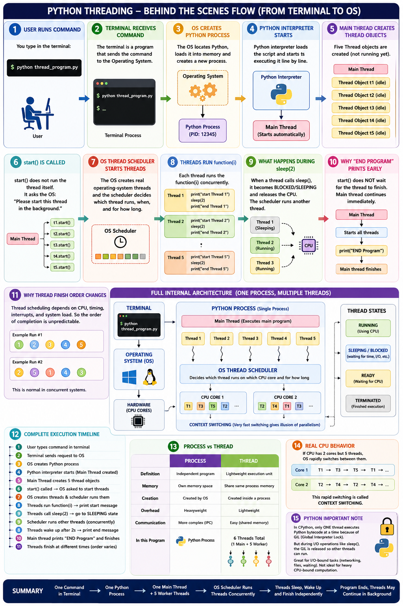
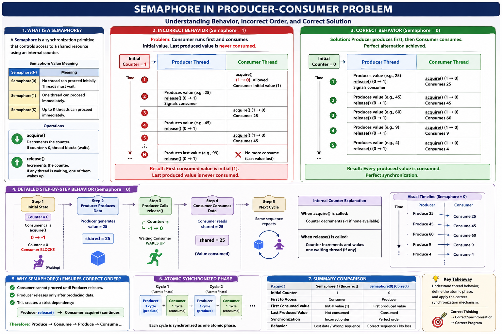

# Threading Example

This folder contains a collection of Python threading examples covering basic thread creation, synchronization primitives, race conditions, and producer-consumer coordination.

## What this package shows

- How to create threads using `threading.Thread`
- How to wait for threads to finish using `join()`
- How to use `concurrent.futures.ThreadPoolExecutor` for a thread pool
- How race conditions occur when threads share mutable state
- How to protect shared state with `threading.Lock` and context managers
- How `threading.RLock` allows nested locking by the same thread
- How `threading.Semaphore` controls access and ordering between threads
- How `threading.Condition` coordinates producer-consumer handoff
- How `threading.Event` signals readiness across threads
- How `queue.Queue` provides thread-safe producer-consumer communication

## Files

- `thread_01_worker.py` — simple worker threads using `join()` to wait for completion
- `thread_02_run_example.py` — helper script that runs the main worker example
- `thread_03_join_sets.py` — split thread groups and wait for each set separately
- `thread_04_threadpool_executor_example.py` — use `ThreadPoolExecutor` to run tasks concurrently
- `thread_05_sequence_ab.py` — unsynchronized threads building a sequence of letters
- `thread_06_race_condition_simple.py` — demonstrate a race condition on shared state
- `thread_07_lock_sync.py` — explicit `Lock.acquire()` / `Lock.release()` synchronization
- `thread_08_with_lock_context_manager.py` — use `with lock:` for safer lock handling
- `thread_09_unusual_lock_behaviour.py` — unusual lock handoff pattern used as turn-taking
- `thread_10_rlock.py` — `RLock` example showing nested acquire/release by the same thread
- `thread_11_semaphore.py` — semaphore used as a mutual-exclusion mechanism in producer-consumer code
- `thread_12_semaphore_with_context.py` — use `with semaphore:` for cleaner semaphore locking
- `thread_13_semaphore_with_multiple_producer.py` — producer-consumer with semaphore and a logic ordering issue
- `thread_14_semaphore_order_issue.py` — demonstrate ordering problems when consumer starts before producer
- `thread_15_semaphore_order.py` — correct producer-consumer order using `Semaphore(0)`
- `thread_16_condition.py` — producer-consumer coordination using `Condition`
- `thread_17_event_based.py` — single producer-consumer example synchronized with `Event`
- `thread_18_event_with_multiple_prd_consumer.py` — multiple producers and consumers using `Event` signals
- `thread_19_queue.py` — producer-consumer synchronization using a thread-safe `Queue`
- `thread_20_queue_v.py` — improved queue example with named producers and consumers for clearer output
- `thread-resources/` — contains sample images illustrating thread and semaphore behavior

## How to run

From the project root, activate the virtual environment and run:

```bash
. .venv/bin/activate
python src/multithreading/thread_01_worker.py
```

Or run any specific example directly:

```bash
python src/multithreading/thread_16_condition.py
python src/multithreading/thread_17_event_based.py
python src/multithreading/thread_20_queue_v.py
```

## Threading concepts

This package includes examples that range from basic thread creation and joining to more advanced synchronization patterns.

- `thread_01_worker.py` and `thread_03_join_sets.py` show how to start threads, run them concurrently, and wait for them with `join()`.
- `thread_04_threadpool_executor_example.py` shows how a thread pool can manage worker threads automatically.
- `thread_05_sequence_ab.py` and `thread_06_race_condition_simple.py` show how unsynchronized threads can produce unexpected order and data corruption.
- `thread_07_lock_sync.py` and `thread_08_with_lock_context_manager.py` demonstrate how locks protect shared state and why using `with lock:` is safer.
- `thread_09_unusual_lock_behaviour.py` shows an advanced lock handoff pattern used for turn-taking, which is generally fragile.
- `thread_10_rlock.py` shows how `RLock` allows a thread to acquire the same lock multiple times safely.
- `thread_11_semaphore.py` through `thread_15_semaphore_order.py` explore semaphore usage, producer-consumer interactions, and how ordering matters in synchronization.
- `thread_16_condition.py` shows how `Condition` variables coordinate threads when shared state changes.
- `thread_17_event_based.py` and `thread_18_event_with_multiple_prd_consumer.py` demonstrate signaling between threads using `Event`.
- `thread_19_queue.py` and `thread_20_queue_v.py` demonstrate how `queue.Queue` provides a simpler, thread-safe producer-consumer implementation.

## Images

### Thread behavior with `join()`



### Thread behavior without `join()`



### Semaphore example



### Condition image


